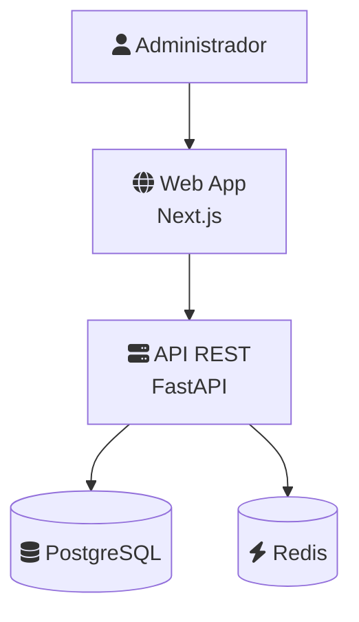

# 🏗️ Modelo C4 — Diagramas de Arquitectura

> **Principio:** La arquitectura se comunica visualmente en 4 niveles de zoom.  
> Cada nivel responde una pregunta diferente para una audiencia diferente.

---

## 🎯 ¿Qué es C4?

C4 (Context, Containers, Components, Code) es un modelo de diagramación que organiza la arquitectura en 4 niveles de detalle progresivo. Como Google Maps: empiezas viendo el país, terminas viendo la calle.

---

## 📊 Los 4 Niveles

### Nivel 1: Diagrama de Contexto (System Context)
**Pregunta:** ¿Qué sistema construimos y quién lo usa?  
**Audiencia:** Stakeholders, gerencia, usuarios no técnicos

```
┌─────────────┐     ┌──────────────────────┐     ┌─────────────┐
│             │     │                      │     │             │
│  Administr. │────▶│    Sistema de         │◀────│  Pasarela   │
│  (persona)  │     │    Presupuestos       │     │  de Pago    │
│             │     │    [Software System]  │     │  [Externo]  │
└─────────────┘     └──────────────────────┘     └─────────────┘
                           │
                           ▼
                    ┌──────────────┐
                    │   Cliente    │
                    │  (persona)   │
                    └──────────────┘
```

**Incluye:** Personas, sistema principal, sistemas externos  
**No incluye:** Tecnologías, componentes internos, BD

---

### Nivel 2: Diagrama de Contenedores (Container Diagram)
**Pregunta:** ¿De qué partes técnicas se compone el sistema?  
**Audiencia:** Desarrolladores, arquitectos, DevOps

```
┌────────────────────────────────────────────────────┐
│                SISTEMA DE PRESUPUESTOS              │
│                                                     │
│  ┌──────────┐  ┌──────────┐  ┌──────────────────┐ │
│  │ Web App  │  │ API Rest │  │ Base de Datos    │ │
│  │ Next.js  │─▶│ FastAPI  │─▶│ PostgreSQL       │ │
│  │ :3000    │  │ :8000    │  │ :5432            │ │
│  └──────────┘  └──────────┘  └──────────────────┘ │
│                     │                               │
│                     ▼                               │
│               ┌──────────┐  ┌──────────────────┐   │
│               │  Cache   │  │ File Storage     │   │
│               │  Redis   │  │ MinIO            │   │
│               │  :6379   │  │ :9000            │   │
│               └──────────┘  └──────────────────┘   │
└────────────────────────────────────────────────────┘
```

**Incluye:** Aplicaciones, servicios, bases de datos, message brokers  
**No incluye:** Clases, funciones, código específico

**Cada contenedor especifica:**
- Nombre y descripción
- Tecnología (Next.js, FastAPI, PostgreSQL)
- Puerto o protocolo
- Responsabilidad principal

---

### Nivel 3: Diagrama de Componentes (Component Diagram)
**Pregunta:** ¿Qué componentes hay dentro de cada contenedor?  
**Audiencia:** Desarrolladores del equipo

```
┌──────────────────── API REST (FastAPI) ────────────────────┐
│                                                             │
│  ┌──────────────┐  ┌──────────────┐  ┌──────────────────┐ │
│  │ Auth         │  │ Budget       │  │ Client           │ │
│  │ Controller   │  │ Controller   │  │ Controller       │ │
│  └──────┬───────┘  └──────┬───────┘  └──────┬───────────┘ │
│         │                 │                  │              │
│         ▼                 ▼                  ▼              │
│  ┌──────────────┐  ┌──────────────┐  ┌──────────────────┐ │
│  │ Auth         │  │ Budget       │  │ Client           │ │
│  │ Service      │  │ Service      │  │ Service          │ │
│  └──────┬───────┘  └──────┬───────┘  └──────┬───────────┘ │
│         │                 │                  │              │
│         ▼                 ▼                  ▼              │
│  ┌──────────────┐  ┌──────────────┐  ┌──────────────────┐ │
│  │ User         │  │ Budget       │  │ Client           │ │
│  │ Repository   │  │ Repository   │  │ Repository       │ │
│  └──────────────┘  └──────────────┘  └──────────────────┘ │
└─────────────────────────────────────────────────────────────┘
```

**Incluye:** Controllers, Services, Repositories, Gateways  
**No incluye:** Funciones individuales, líneas de código

---

### Nivel 4: Diagrama de Código (Code Diagram)
**Pregunta:** ¿Cómo está implementado internamente un componente?  
**Audiencia:** Desarrollador que va a modificar ese componente

```
Generalmente es un diagrama de clases UML del componente.
Solo se genera bajo petición — es el nivel más granular.
En la mayoría de proyectos, el Nivel 3 es suficiente.
```

---

## 📋 Reglas del Sistema para C4

```
1. Todo proyecto auditado o construido genera mínimo Nivel 1 y Nivel 2
2. Nivel 3 solo cuando el dominio tiene 5+ componentes por contenedor
3. Nivel 4 solo bajo petición explícita del usuario
4. Usar ASCII art en markdown (no se requiere herramienta externa)
5. Mermaid como alternativa para diagramas renderizables
6. Cada diagrama incluye leyenda de colores/formas si aplica
7. Actualizar diagramas cuando cambia la arquitectura (no son estáticos)
```

---

## 🧜 Formato Mermaid (alternativa renderizable)



---

## ✅ Checklist C4

- [ ] Nivel 1 (Context): todos los actores y sistemas externos identificados
- [ ] Nivel 2 (Containers): tecnología y responsabilidad de cada contenedor
- [ ] Flujos de comunicación documentados (quién llama a quién)
- [ ] Protocolos especificados (HTTP, WebSocket, gRPC, AMQP)
- [ ] Sistemas externos claramente diferenciados del sistema propio
- [ ] Diagrama actualizado con la arquitectura real (no la ideal)
