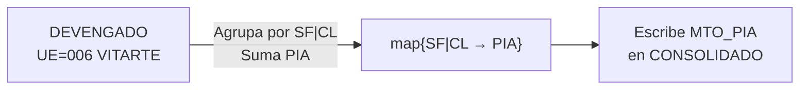
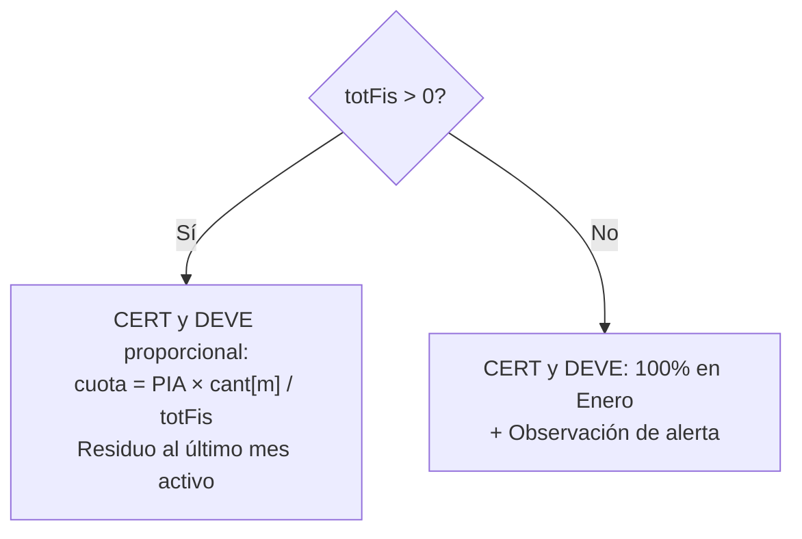
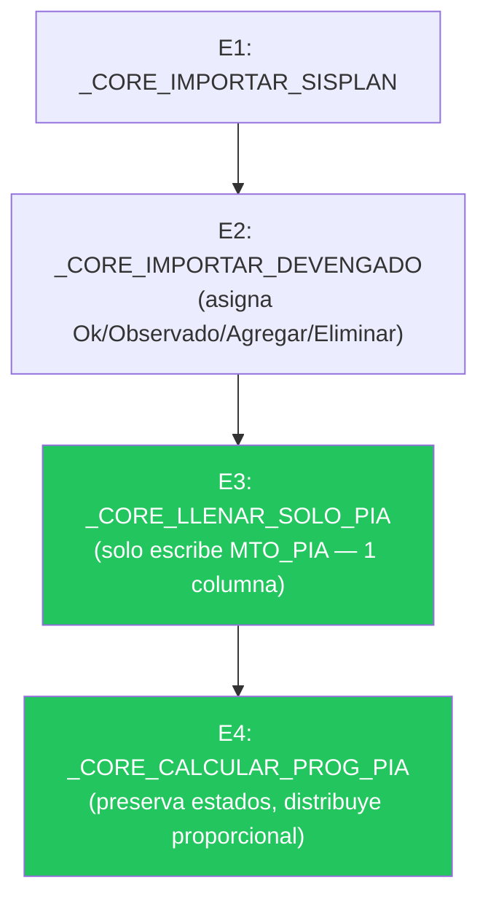

# Auditoría Comparativa: Flujo NORMAL vs Flujo PIA — Estado de Correcciones

> **SISCOP** · Auditoría de Procesos de Consolidación  
> Fecha: Abril 2026 · **Post-implementación**

---

## Resumen de Hallazgos y Estado

| # | Severidad | Hallazgo | Estado | Archivo |
|---|---|---|---|---|
| H-01 | 🔴 | Etapa 3 ejecuta trabajo inútil en PIA | ✅ **Corregido** | `2_core.js`, `1_api.js` |
| H-02 | 🔴 | Cert 100% en Enero (sin distribución) | ✅ **Corregido** | `2_core.js` |
| H-03 | 🔴 | PIA sobrescribe estados/observaciones de E2 | ✅ **Corregido** | `2_core.js` |
| H-04 | 🔴 | mesCorte=11 copia ejecución innecesaria | ✅ **Corregido** | `1_api.js` |
| H-05 | 🟡 | clearContents() destructivo | ✅ **Corregido** | `2_core.js` |
| H-06 | 🟡 | Normalización SEC_FUNC inconsistente | ✅ **Corregido** (nueva `_normSF`) | `3_utils.js`, `2_core.js` |
| H-07 | 🟡 | clavesExist `[]` usado como `{}` | ✅ **Corregido** | `2_core.js` |
| H-08 | 🟡 | PIA conserva filas vacías SF='' | ✅ **Corregido** | `2_core.js` |
| H-09 | 🟡 | PIA pierde info de estado de E2 | ✅ **Corregido** | `2_core.js` |
| H-10 | 🔵 | `_totEjeIgnorado` no usado | ⬜ Pendiente | — |
| H-11 | 🔵 | Totales no limpiados para PIA=0 | ✅ **Corregido** | `2_core.js` |
| H-12 | 🔵 | Sort puede desalinear datos | ⬜ Pendiente | — |
| H-13 | 🔵 | Validación frontend ≠ backend | ⬜ Pendiente | — |
| H-14 | 🔵 | PIA con totFis=0 sin observación | ✅ **Corregido** | `2_core.js` |
| H-15 | ⚪ | Variables var hoisted duplicadas | ✅ **Corregido** (rama PIA) | `1_api.js` |
| H-16 | ⚪ | getExportLog duplicada | ✅ **Corregido** | `1_api.js` |

**Score: 12/15 hallazgos corregidos.**

---

## Cambios Implementados

### 1. Nueva función: `_CORE_LLENAR_SOLO_PIA(ss)` — [2_core.js:204-238](file:///c:/Users/Finanzas003/Desktop/Proyectos/siscop/app/2_core.js#L204-L238)

**Propósito:** Reemplaza `_CORE_LLENAR_PIA_PIM` en el flujo PIA. Solo lee el monto PIA del DEVENGADO y lo escribe en el CONSOLIDADO. No toca PIM, no copia ejecución, no modifica estados.



**Ventajas vs _CORE_LLENAR_PIA_PIM:**
- **1 llamada setValues** vs 5 → ahorro de ~5-10s I/O
- No escribe PIM, EJE_DEVE, ESTADO, OBSERVACION → no contamina datos
- Usa `_normSF` centralizada

---

### 2. Reescritura: `_CORE_CALCULAR_PROG_PIA(ss)` — [2_core.js:358-491](file:///c:/Users/Finanzas003/Desktop/Proyectos/siscop/app/2_core.js#L358-L491)

**Reglas de negocio implementadas:**

| Condición | Estado | Observación |
|---|---|---|
| PIA = 0 | `Eliminar` | "PIA es 0 en DEVENGADO. Eliminar de SISPLAN." + obs previa |
| PIA > 0 + estado era Agregar | `Agregar` (preservado) | obs previa + "PIA Proyectado Automáticamente" |
| PIA > 0 + estado era Observado | `Observado` (preservado) | obs previa (AO/UM difiere) + "PIA Proyectado Automáticamente" |
| PIA > 0 + estado era Ok/vacío | `Ok` | "PIA Proyectado Automáticamente" |
| PIA > 0 + totFis = 0 | Estado previo | obs previa + "Sin meses activos en SISPLAN. PIA asignado a Enero." |

**Distribución de programación:**



**Escritura atómica:**
```
1. setValues(cabeceras + filtrado)  ← escribe datos nuevos
2. Si hay filas sobrantes → clearContent solo las excedentes ← limpia residuo
```
Si falla en paso 2, los datos válidos ya están escritos.

---

### 3. Utilidad centralizada: `_normSF(val)` — [3_utils.js:8](file:///c:/Users/Finanzas003/Desktop/Proyectos/siscop/app/3_utils.js#L8)

```javascript
function _normSF(val) {
  var n = parseInt(Number(val), 10);
  return isNaN(n) ? '0000' : String(n).padStart(4, '0');
}
```

Cubre: `16` → `"0016"`, `"0016"` → `"0016"`, `" 16 "` → `"0016"`, `null` → `"0000"`

---

### 4. Orquestador actualizado — [1_api.js:136-138](file:///c:/Users/Finanzas003/Desktop/Proyectos/siscop/app/1_api.js#L136-L138)

**Pipeline PIA corregido:**



**Pipeline NORMAL (sin cambios):**
```
E1 → E2 → E3:_CORE_LLENAR_PIA_PIM → E4:_CORE_LLENAR_EJE_CERT → E5:_CORE_CALCULAR_PROG
```

---

### 5. Dead code eliminado — [1_api.js:477-478](file:///c:/Users/Finanzas003/Desktop/Proyectos/siscop/app/1_api.js#L477-L478)

`getExportLog()` duplicada eliminada de `1_api.js`. La versión activa en `3_utils.js` (lee desde BD Historial) sigue operativa.

---

## Archivos Modificados

| Archivo | Cambios |
|---|---|
| [3_utils.js](file:///c:/Users/Finanzas003/Desktop/Proyectos/siscop/app/3_utils.js) | +1 función `_normSF` |
| [2_core.js](file:///c:/Users/Finanzas003/Desktop/Proyectos/siscop/app/2_core.js) | `clavesExist` fix, +`_CORE_LLENAR_SOLO_PIA`, rewrite `_CORE_CALCULAR_PROG_PIA` |
| [1_api.js](file:///c:/Users/Finanzas003/Desktop/Proyectos/siscop/app/1_api.js) | PIA branch → `_CORE_LLENAR_SOLO_PIA`, `getExportLog` eliminada, vars renombradas |

---

## Pendientes (P3 — Backlog)

| # | Hallazgo | Acción | Esfuerzo |
|---|---|---|---|
| H-10 | `_totEjeIgnorado` en `_calcGenerico` | Eliminar param o usar como assertion | Trivial |
| H-12 | Sort post-E2 puede desalinear | Mover sort dentro de E2 antes de flush | Bajo |
| H-13 | Validación columnas frontend ≠ backend | Unificar en CONFIG | Bajo |
