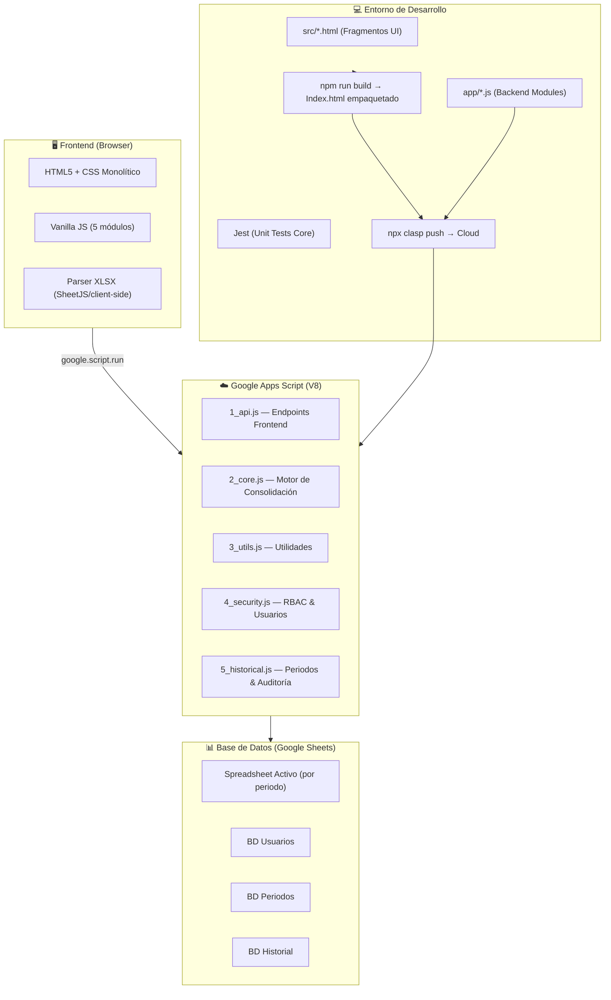
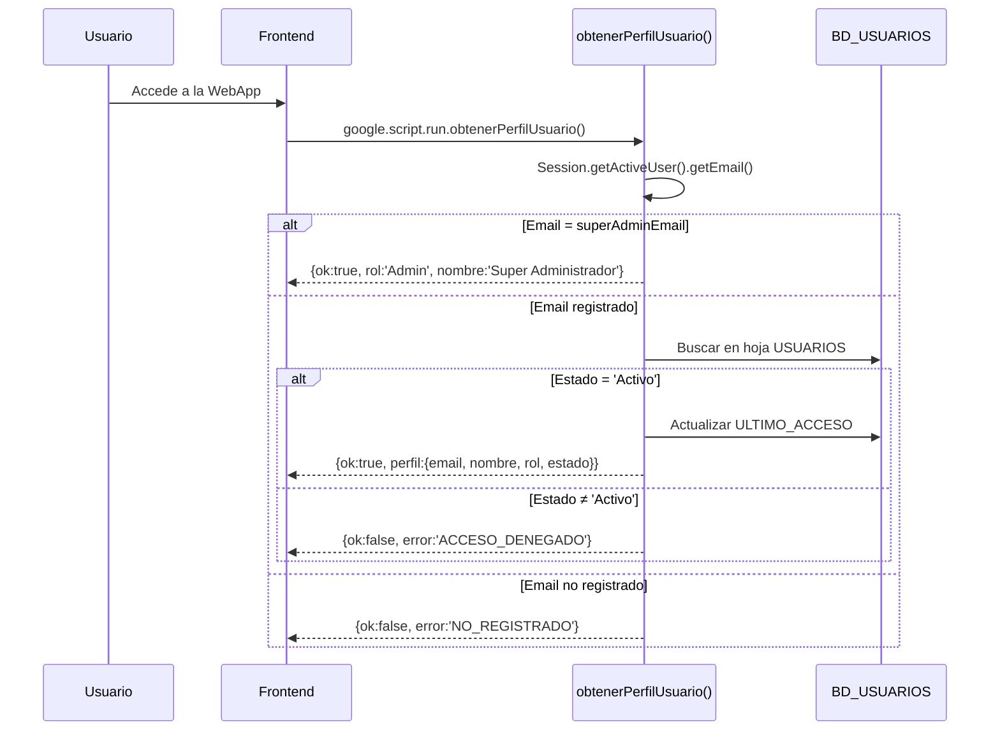
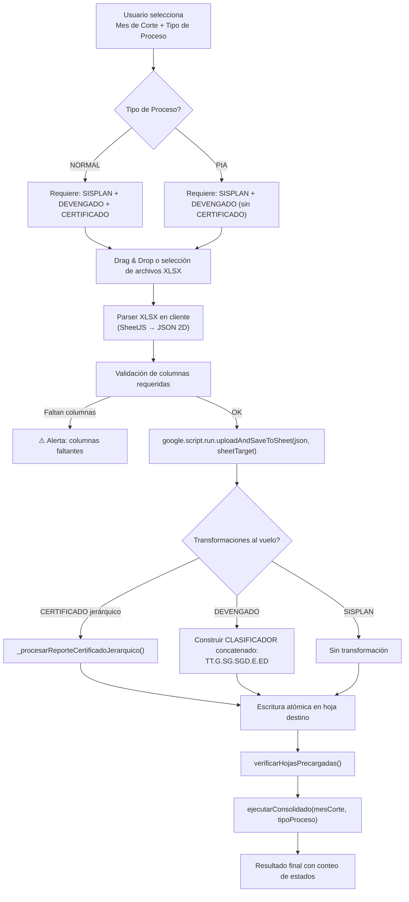
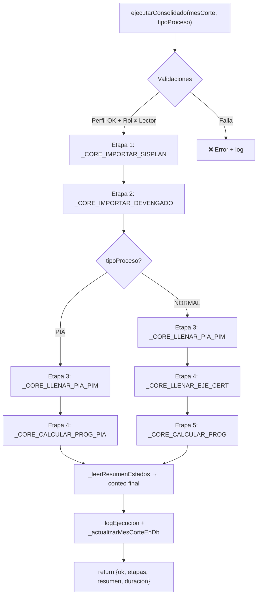
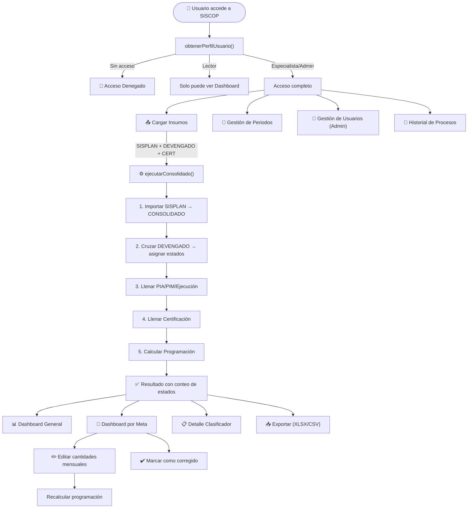
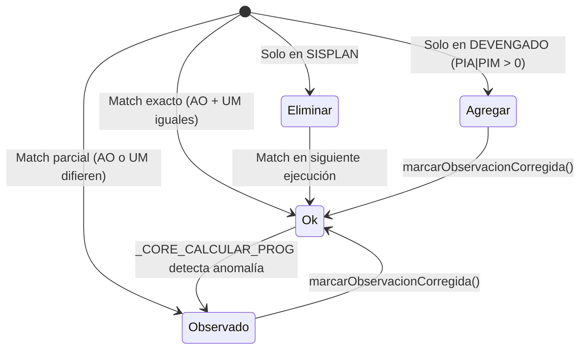

# SISCOP — Documentación Técnica del Sistema

> **Sistema de Conciliación y Programación Presupuestal**  
> UGEL 06 VITARTE · Área de Planificación y Presupuesto  
> Versión 2.0 · Última actualización: Abril 2026

---

## 1. Identidad del Sistema

| Atributo | Valor |
|---|---|
| **Nombre** | SISCOP |
| **Propósito** | Consolidar insumos presupuestales (SISPLAN, Devengado, Certificado), cruzarlos automáticamente, detectar discrepancias y generar la programación mensual de certificación y devengado por meta/clasificador. |
| **Entidad** | UGEL 06 VITARTE — Área de Planificación y Presupuesto |
| **Usuarios objetivo** | Especialistas de presupuesto, planificadores y administradores de la UGEL 06 |
| **URL producción** | `https://script.google.com/macros/s/.../exec` (Web App de Google Apps Script) |

---

## 2. Stack Tecnológico



| Capa | Tecnología | Notas |
|---|---|---|
| **Backend** | Google Apps Script V8 | Límite de ejecución: 6 min/invocación |
| **Frontend** | Vanilla HTML5 + CSS + JS | SPA monolítica inyectada vía `HtmlService` |
| **Base de datos** | Google Sheets (SpreadsheetApp) | Matrices 2D masivas en memoria |
| **Infraestructura** | Google Cloud (PaaS Serverless) | Autenticación OAuth implícita |
| **Build pipeline** | Node.js + Vite + clasp | `npm run build` → `clasp push` |
| **Testing** | Jest | Solo cubre `_calcGenerico` en `2_core.js` |

---

## 3. Arquitectura de Datos

### 3.1 Spreadsheets del Ecosistema

El sistema opera sobre **4 Google Sheets independientes**, cada uno con un ID fijo en `CONFIG`:

| Spreadsheet | CONFIG key | Propósito |
|---|---|---|
| **Spreadsheet Activo** | `spreadsheetId` (default) + `UserProperties.sisgep_periodo_ssId` | Contiene las hojas de trabajo del periodo fiscal activo |
| **BD Usuarios** | `idBaseDatosUsuarios` | Registro de accesos, roles y último login |
| **BD Periodos** | `idDbPeriodos` | Catálogo de años fiscales con links a sus Spreadsheets |
| **BD Historial** | `idBaseDatosHistorial` | Log global de acciones y log de exportaciones |

### 3.2 Hojas del Spreadsheet Activo

| Hoja | Clave CONFIG | Fila Encabezado | Función |
|---|---|---|---|
| `SISPLAN` | `hojas.sisplan` | Fila 1 | Programación anual de metas (fuente primaria de cantidades físicas mensuales) |
| `DEVENGADO` | `hojas.devengado` | Fila 1 | Ejecución presupuestal del SIAF (PIA, PIM, devengado mensual por UE/clasificador) |
| `CERTIFICADO` | `hojas.certificado` | Fila 1 | Ejecución de certificación mensual (reporte jerárquico del SIAF aplanado) |
| `CONSOLIDADO` | `hojas.consolidado` | **Fila 3** | Resultado final del cruce. Contiene 60+ columnas con programación, ejecución y estados |
| `AUDIT_LOG` | `hojas.auditLog` | Fila 1 | Log de ejecuciones del consolidado (oculta) |
| `EXPORT_LOG` | `hojas.exportLog` | Fila 1 | Log de exportaciones (se escribe en BD Historial, no local) |

### 3.3 Estructura del CONSOLIDADO (hoja maestra)

La hoja `CONSOLIDADO` tiene **3 filas de encabezado** (fila 3 = headers de columna). Las columnas se organizan en grupos lógicos:

| Grupo | Columnas Clave |
|---|---|
| **Identidad** | `SEC_FUNC`, `DENOMINACION_AO`, `UNIDAD_MEDIDA`, `CLASIFICADOR_CODIGO`, `RECURSO` |
| **Cantidades Físicas** | `CANT_ENE` … `CANT_DIC`, `TOTAL_FISICO` |
| **Presupuesto** | `MTO_PIA`, `MTO_PIM` |
| **Ejecución Certificado** | `EJE_CERT_ENE` … `EJE_CERT_DIC`, `TOTAL_EJEC_CERTIF` |
| **Ejecución Devengado** | `EJE_DEVE_ENE` … `EJE_DEVE_DIC`, `TOTAL_EJEC_DEV` |
| **Programación Certificado** | `CERT_ENE` … `CERT_DIC`, `TOTAL_CERTIF_PROG` |
| **Programación Devengado** | `DEVE_ENE` … `DEVE_DIC`, `TOTAL_DEV_PROG` |
| **Control** | `ESTADO`, `OBSERVACION` |

---

## 4. Modelo de Seguridad (RBAC)

### 4.1 Roles del Sistema

| Rol | Procesar | Exportar | Editar Datos | Gestionar Usuarios | Ver Dashboard |
|---|---|---|---|---|---|
| **Admin** | ✅ | ✅ | ✅ | ✅ | ✅ |
| **Especialista** | ✅ | ✅ | ✅ | ❌ | ✅ |
| **Lector** | ❌ | ❌ | ❌ | ❌ | ✅ |

### 4.2 Flujo de Autenticación



### 4.3 Condiciones de Seguridad por Proceso

| Proceso | Verificación | Error si falla |
|---|---|---|
| `uploadAndSaveToSheet` | `obtenerPerfilUsuario().ok` + `rol ≠ 'Lector'` | `ACCESO DENEGADO` |
| `ejecutarConsolidado` | `obtenerPerfilUsuario().ok` + `rol ≠ 'Lector'` | `ACCESO DENEGADO` |
| `exportConsolidado` | `obtenerPerfilUsuario().ok` + `rol ≠ 'Lector'` | `ACCESO DENEGADO` |
| `marcarObservacionCorregida` | `obtenerPerfilUsuario().ok` + `rol ≠ 'Lector'` | `ACCESO DENEGADO` |
| `actualizarCantMensual` | `obtenerPerfilUsuario().ok` + `rol ≠ 'Lector'` | `Sin permisos` |
| `agregarNuevoPeriodo` | `obtenerPerfilUsuario().ok` + `rol ≠ 'Lector'` | `Sin permisos para crear periodos` |
| `registrarNuevoUsuario` | Implícita (solo visible para Admin) | Solo Admin ve la sección |
| `getResumenGeneral` | Ninguna (lectura pública) | — |

---

## 5. Módulos Funcionales

### 5.1 Módulo: Carga de Insumos (`page-upload`)

**Archivo Frontend:** [View_Upload.html](file:///c:/Users/Finanzas003/Desktop/Proyectos/siscop/src/View_Upload.html) · [JS_Upload.html](file:///c:/Users/Finanzas003/Desktop/Proyectos/siscop/src/JS_Upload.html)  
**Archivo Backend:** [1_api.js](file:///c:/Users/Finanzas003/Desktop/Proyectos/siscop/app/1_api.js) → `uploadAndSaveToSheet()`, `verificarHojasPrecargadas()`, `ejecutarConsolidado()`

#### 5.1.1 Descripción
Permite al usuario cargar archivos Excel (.xlsx) con datos presupuestales de tres fuentes: SISPLAN (programación anual), DEVENGADO (ejecución SIAF) y CERTIFICADO (certificación SIAF). Luego ejecuta el proceso de consolidación.

#### 5.1.2 Flujo del Proceso



#### 5.1.3 Precondiciones

| Condición | Detalle |
|---|---|
| **Mes de corte** | Obligatorio. Índice 0-11 (Enero=0, Diciembre=11). Define hasta qué mes se lee ejecución real. |
| **Tipo de proceso** | `NORMAL` (requiere 3 insumos) o `PIA` (solo SISPLAN + DEVENGADO, sin Certificado). |
| **Formato de archivos** | `.xlsx` o `.xls`. Parseados en cliente con SheetJS a JSON 2D. |
| **Columnas requeridas SISPLAN** | `DENOMINACION_AO`, `UNIDAD_MEDIDA`, `SEC_FUNC`, `CLASIFICADOR_CODIGO`, `RECURSO`, `CANT_ENE` |
| **Columnas requeridas DEVENGADO** | `UNIDAD_EJECUTORA`, `SEC_FUNC`, `UNIDAD_MEDIDA`, `TIPO_TRANSACCION`, `GENERICA`, `SUBGENERICA`, `SUBGENERICA_DET`, `ESPECIFICA`, `ESPECIFICA_DET`, `ACTIV_OBRA_ACCINV`, `MTO_PIA`, `MTO_PIM`, `MTO_DEVENGA_01` |
| **Columnas requeridas CERTIFICADO** | No validadas (se acepta cualquier estructura, se detecta jerárquica automáticamente) |
| **Rol mínimo** | Especialista o Admin |

#### 5.1.4 Transformaciones de Datos

**CERTIFICADO (Aplanamiento jerárquico):**  
- **Condición de activación:** Se detecta si la celda B6 o B7 contiene "SECTOR" o "PLIEGO"
- **Proceso:** Convierte el reporte jerárquico del SIAF (estructura con indentación) en una tabla plana con columnas: `SEC_FUNC`, `PROGRAMA_PPTAL`, `PRODUCTO_PROYECTO`, `ACTIV_OBRA_ACCINV`, `META`, `FINALIDAD`, `UNIDAD_MEDIDA`, `CANT_META_ANUAL`, `RUBRO`, `DEPARTAMENTO_META`, `PROVINCIA_META`, `DISTRITO_META`, `CLASIFICADOR`, `CLASIFICADOR_DETALLE`, `PIA`, `MODIFIC`, `PIM`, `ENE`…`DIC`, `TOTAL_EJEC_CERTIF`, `SALDO`
- **Rubro fijo:** Siempre `"00 RECURSOS ORDINARIOS"`

**DEVENGADO (Generación de clasificador compuesto):**
- **Proceso:** Concatena los campos `TIPO_TRANSACCION.GENERICA.SUBGENERICA.SUBGENERICA_DET.ESPECIFICA.ESPECIFICA_DET` en una columna `CLASIFICADOR`
- **Columna adicional:** `CLASIFICADOR_DETALLE` con el texto después del punto en `ESPECIFICA_DET`
- **Inserción:** Ambas columnas se insertan justo antes de `MTO_PIA` en la posición de los datos

#### 5.1.5 Postcondiciones
- La hoja destino se limpia completamente (`clearContents`) y se reescribe con los datos transformados
- Se registra un log en `_registrarLog('Carga de Insumos', ...)` en la BD Historial
- Se retorna `{ rows: N, sheet: nombre, warnings: [] }`

---

### 5.2 Módulo: Motor de Consolidación (`ejecutarConsolidado`)

**Archivo Backend:** [1_api.js](file:///c:/Users/Finanzas003/Desktop/Proyectos/siscop/app/1_api.js#L114-L162) + [2_core.js](file:///c:/Users/Finanzas003/Desktop/Proyectos/siscop/app/2_core.js)

#### 5.2.1 Descripción
Proceso principal del sistema. Ejecuta 4-5 etapas secuenciales que cruzan SISPLAN × DEVENGADO × CERTIFICADO para generar el consolidado presupuestal con programación automática.

#### 5.2.2 Pipeline de Etapas



#### 5.2.3 Etapa 1: Importar SISPLAN (`_CORE_IMPORTAR_SISPLAN`)

**Propósito:** Trasladar las filas del SISPLAN hacia el CONSOLIDADO como base del cruce.

| Aspecto | Detalle |
|---|---|
| **Entrada** | Hoja `SISPLAN` (fila 1 = encabezados) |
| **Salida** | Hoja `CONSOLIDADO` (desde fila 4) |
| **Columnas mapeadas** | `DENOMINACION_AO`, `UNIDAD_MEDIDA`, `SEC_FUNC`, `CLASIFICADOR_CODIGO`, `RECURSO`, `CANT_ENE`…`CANT_DIC`, `TOTAL_FISICO` |
| **Normalización SEC_FUNC** | Se quitan ceros iniciales, luego se rellena a 4 dígitos (ej: `16` → `0016`) |
| **Normalización CLASIFICADOR** | Se eliminan todos los espacios en blanco |
| **Normalización Cantidades** | `''` o `null` → `0` |
| **Efecto destructivo** | ⚠️ Limpia todo el contenido existente del CONSOLIDADO debajo de la fila 3 antes de escribir |

#### 5.2.4 Etapa 2: Importar DEVENGADO (`_CORE_IMPORTAR_DEVENGADO`)

**Propósito:** Cruzar los clasificadores del DEVENGADO contra los del CONSOLIDADO (ya poblado por SISPLAN) para asignar estados y detectar discrepancias.

| Aspecto | Detalle |
|---|---|
| **Filtro de UE** | Solo procesa filas donde `UNIDAD_EJECUTORA === "006. USE 06 VITARTE"` |
| **Agrupación** | Agrupa por clave compuesta `SEC_FUNC|CLASIFICADOR` |
| **Datos extraídos del DEVENGADO** | `denom` (actividad), `um` (unidad medida), `rec` (recurso/detalle), `pia`, `pim` |

**Reglas de asignación de ESTADO:**

| Caso | Condición | Estado Asignado | Observación |
|---|---|---|---|
| **Match exacto** | Clasificador existe en ambos + AO y UM coinciden | `Ok` | (si no tenía estado previo o era `Eliminar`) |
| **Match parcial** | Clasificador existe en ambos + AO o UM difieren | `Observado` | `"AO difiere: X"` o `"UM difiere: Y"` |
| **Solo en SISPLAN** | Clasificador en SISPLAN pero NO en DEVENGADO | `Eliminar` | `"No encontrado en DEVENGADO, eliminar de SISPLAN"` |
| **Solo en DEVENGADO** | Clasificador en DEVENGADO pero NO en SISPLAN, con PIA o PIM > 0 | `Agregar` | `"Agregado desde DEVENGADO"` — Se inserta nueva fila al final del CONSOLIDADO con cantidades en 0 |
| **Solo en DEVENGADO (PIA=0, PIM=0)** | Clasificador nuevo pero sin presupuesto | *Ignorado* | No se agrega fila |

#### 5.2.5 Etapa 3: Llenar PIA/PIM (`_CORE_LLENAR_PIA_PIM`)

**Propósito:** Escribir los montos PIA, PIM y la ejecución mensual de devengado en el CONSOLIDADO.

| Aspecto | Detalle |
|---|---|
| **Fuente** | Hoja `DEVENGADO`, columnas `MTO_PIA`, `MTO_PIM`, `MTO_DEVENGA_01`…`MTO_DEVENGA_12` |
| **Filtro** | Solo UE `"006. USE 06 VITARTE"` |
| **Mapeo** | `SEC_FUNC|CLASIFICADOR` del DEVENGADO → `SEC_FUNC|CLASIFICADOR_CODIGO` del CONSOLIDADO |
| **Ejecución devengado** | Solo se copian montos hasta el `mesCorte` (inclusive). Meses posteriores se dejan en 0. |
| **Total Ejecución Devengado** | Columna 13 del bloque = suma de los 12 meses copiados |
| **Sin match** | Si un clasificador del CONSOLIDADO no tiene match en DEVENGADO → `Eliminar` + observación |

#### 5.2.6 Etapa 4a: Llenar Ejecución Certificado (`_CORE_LLENAR_EJE_CERT`) — Solo proceso NORMAL

**Propósito:** Escribir la ejecución mensual de certificación desde la hoja CERTIFICADO.

| Aspecto | Detalle |
|---|---|
| **Fuente** | Hoja `CERTIFICADO`, columnas `ENE`…`DIC` |
| **Mapeo** | `SEC_FUNC|CLASIFICADOR` (normalizado con pad a 4 dígitos) |
| **Ubicación destino** | Se busca el 2do bloque `CERTIFICACIÓN` en la fila 2 del CONSOLIDADO |
| **Corte mensual** | Solo se copian valores hasta `mesCorte`. Meses posteriores = 0. |
| **Total** | Columna 13 = suma de los 12 meses |

> [!IMPORTANT]
> Si no se encuentra el 2do bloque `CERTIFICACION` en la fila 2 del CONSOLIDADO, el proceso lanza error: `"No se encontró el 2do bloque CERTIFICACION en fila 2 del CONSOLIDADO."`

#### 5.2.7 Etapa 5a: Calcular Programación NORMAL (`_CORE_CALCULAR_PROG`) — Solo proceso NORMAL

**Propósito:** Distribuir el saldo presupuestal no ejecutado entre los meses futuros activos.

**Algoritmo `_calcGenerico(pim, cant, eje, totEje, mesCorte, tipo)`:**

```
1. Para meses 0..mesCorte: programación[mes] = ejecución_real[mes]  (copia literal)
2. ejeAcum = Σ ejecución_real[0..mesCorte]
3. saldo = max(0, PIM - ejeAcum)  (redondeado a 2 decimales)
4. mesesActivos = meses donde mesCorte+1..11 AND cantidad_fisica[mes] > 0
5. SI hay meses activos Y saldo > 0:
     cuota = floor(saldo / N_activos * 100) / 100
     Asignar cuota a cada mes activo (excepto el último)
     Último mes activo = cuota + residuo (para cuadrar exacto)
6. SI NO hay meses activos Y saldo > 0.005:
     Acumular todo el saldo en Diciembre
     Observación: "TIPO: Sin meses activos. Saldo S/ X acumulado en DIC."
```

**Postcondiciones:**
- Si hay observaciones de CERT o DEVE → Estado pasa a `Observado`
- Se escribe atómicamente todo el DataRange del CONSOLIDADO

#### 5.2.8 Etapa 4b: Calcular Programación PIA (`_CORE_CALCULAR_PROG_PIA`) — Solo proceso PIA

**Propósito:** Proyectar la distribución del PIA anual proporcionalmente a las cantidades físicas mensuales.

**Algoritmo:**

```
1. Para cada clasificador en CONSOLIDADO:
   - PIM = 0, Ejecución Cert = 0, Ejecución Deve = 0 (se resetean)
   - SI PIA = 0:
       Estado = 'Observado'
       Observación = 'Clasificador activo en SISPLAN pero con PIA 0 en DEVENGADO'
       Todas las programaciones = 0
   - SI PIA > 0 Y Total Físico > 0:
       Certificación: 100% del PIA se asigna a Enero (mes 0)
       Devengado: PIA se distribuye proporcional a cant_mes / total_fisico
       Se redistribuye residuo al último mes activo
   - SI PIA > 0 Y Total Físico = 0:
       Certificación: PIA en Enero
       Devengado: PIA en Enero
   - Estado = 'Ok', Observación = 'PIA Proyectado Automáticamente'
2. Se filtran filas vacías (SEC_FUNC '' o '0000')
3. Escritura atómica: se limpia el consolidado y se reescribe con cabeceras + datos
```

> [!WARNING]
> El proceso PIA es **destructivo**: limpia todo el CONSOLIDADO y lo reescribe. Los clasificadores con PIA=0 se conservan pero quedan observados.

#### 5.2.9 Resumen de Ejecución

Al finalizar, el sistema:
1. Cuenta estados finales via `_leerResumenEstados()` → `{ok, observado, agregar, eliminar}`
2. Registra en `AUDIT_LOG` con timestamp, usuario, mes de corte, duración, resultado y resumen JSON
3. Actualiza el mes de corte en `DB_PERIODOS`
4. Registra en `BD_Historial` via `_registrarLog()`
5. Retorna al frontend: `{ ok:true, etapas:[{nombre, duracion}], resumen:{...}, duracion:N }`

---

### 5.3 Módulo: Dashboard General (`page-dashboard`)

**Archivo Frontend:** [View_Dashboard.html](file:///c:/Users/Finanzas003/Desktop/Proyectos/siscop/src/View_Dashboard.html) · [JS_Dashboard.html](file:///c:/Users/Finanzas003/Desktop/Proyectos/siscop/src/JS_Dashboard.html)  
**Archivo Backend:** [1_api.js](file:///c:/Users/Finanzas003/Desktop/Proyectos/siscop/app/1_api.js#L165-L271) → `getResumenGeneral()`

#### 5.3.1 Datos Mostrados

| KPI | Cálculo |
|---|---|
| **PIA Total** | Suma de PIA (una vez por meta, no duplicado) |
| **PIM Total** | Σ `MTO_PIM` de todos los clasificadores |
| **% Certificación** | `ejeCert / pim * 100` |
| **% Devengado** | `ejeDeve / pim * 100` |

#### 5.3.2 Tabla de Metas Presupuestales

Cada fila representa una `SEC_FUNC` (meta) agrupada con:
- PIM agregado
- % Certificación y % Devengado
- Estado general (prioridad: `Eliminar` > `Observado` > `Agregar` > `Ok`)
- **Contadores por estado** (`counts: {ok, obs, add, del}`) — permite ver mini-chips en el UI

#### 5.3.3 Funcionalidades UI
- **Filtros por estado:** Botones chip (Ok, Obs, Add, Del) para filtrar metas
- **Búsqueda:** Por SEC_FUNC o denominación
- **Paginación:** 5, 10, 20 o todos
- **Ordenamiento:** Por SEC_FUNC, PIM, % Cert o % Deve
- **Modo PIA:** Oculta columnas PIM, % Cert, % Deve cuando el periodo es PIA

---

### 5.4 Módulo: Dashboard por Meta (`page-meta`)

**Archivo Frontend:** [View_Meta.html](file:///c:/Users/Finanzas003/Desktop/Proyectos/siscop/src/View_Meta.html)  
**Archivo Backend:** [1_api.js](file:///c:/Users/Finanzas003/Desktop/Proyectos/siscop/app/1_api.js#L300-L364) → `getDatosSecFunc(secFunc)`, `getSecFuncList()`

#### 5.4.1 Descripción
Vista detallada de una meta individual. Muestra todos los clasificadores asociados a una `SEC_FUNC` con su programación y ejecución mensual desglosada.

#### 5.4.2 Datos Retornados por `getDatosSecFunc`

```javascript
{
  secFunc: "0016",
  denominacion: "CONTRATACION OPORTUNA...",
  unidadMedida: "INSTITUCION EDUCATIVA",
  estadosCount: { ok:12, observado:2, agregar:1, eliminar:0 },
  totales: { pia:0, pim:1500000, ejeCert:800000, ejeDeve:750000 },
  clasificadores: [{
    clasificador: "2.3.1.1.1.1",
    recurso: "RECURSOS ORDINARIOS",
    estado: "Ok",
    observacion: "",
    pia: 0, pim: 50000,
    totalFisico: 12,
    certTotal: 50000, deveTotal: 50000,
    ejeCertTotal: 25000, ejeDeveTotal: 23000,
    cantM: [1,1,1,1,1,1,1,1,1,1,1,1],    // 12 meses
    certM: [...], deveM: [...],             // programación
    ejeCertM: [...], ejeDeveM: [...]        // ejecución real
  }]
}
```

#### 5.4.3 Funcionalidades
- Barras de progreso de certificación y devengado
- KPIs por meta (PIA, PIM, Ejec Cert, Ejec Deve)
- **Alertas de observación agrupadas** con opción de marcar como corregidas
- Tabla de clasificadores con búsqueda, paginación y click para ver detalle
- Modo responsive (tabla desktop / cards mobile)

---

### 5.5 Módulo: Detalle de Clasificador (`page-clasif`)

**Archivo Frontend:** [View_Clasificadores.html](file:///c:/Users/Finanzas003/Desktop/Proyectos/siscop/src/View_Clasificadores.html)  
**Archivo Backend:** `getDatosSecFunc()` (reutiliza la misma API) + `actualizarCantMensual()`

#### 5.5.1 Descripción
Vista master-detail que muestra la programación y ejecución mensual de un clasificador específico dentro de una meta. Permite **editar cantidades físicas mensuales** inline.

#### 5.5.2 Edición de Cantidades (`actualizarCantMensual`)

**Precondiciones:**
- Rol ≠ Lector
- Meses cerrados (≤ mesCorte) son **inmutables** en backend (barrera de hierro)

**Proceso:**

```
1. Localizar fila por SEC_FUNC + CLASIFICADOR_CODIGO
2. Para cada mes m = 0..11:
   - SI m <= mesCorte: usar valor ORIGINAL de la BD (inviolable)
   - SI m > mesCorte: usar valor enviado por el usuario
3. Escribir cantidades sanitizadas en la hoja
4. Recalcular TOTAL_FISICO = Σ cantidades
5. Re-ejecutar _calcGenerico para CERT y DEVE con el nuevo vector de cantidades
6. Escribir programación CERT y DEVE actualizada
7. Retornar: { ok, totalFisico, cantM, certM, deveM, certTotal, deveTotal }
```

> [!IMPORTANT]
> **Barrera de Hierro:** Los meses cerrados (anteriores o iguales al mes de corte) NO pueden ser modificados desde el frontend. El backend siempre lee el valor original de la BD para esos meses, ignorando lo que envíe el cliente.

---

### 5.6 Módulo: Exportación (`page-export`)

**Archivo Frontend:** [View_Exportar.html](file:///c:/Users/Finanzas003/Desktop/Proyectos/siscop/src/View_Exportar.html) · [JS_Editor.html](file:///c:/Users/Finanzas003/Desktop/Proyectos/siscop/src/JS_Editor.html)  
**Archivo Backend:** [1_api.js](file:///c:/Users/Finanzas003/Desktop/Proyectos/siscop/app/1_api.js#L392-L508) → `exportConsolidado(filtro)`

#### 5.6.1 Tipos de Exportación

| Tipo | Filtro | Formato | Descripción |
|---|---|---|---|
| `completo` | Ninguno | XLSX | Toda la hoja CONSOLIDADO tal cual |
| `observados` | `ESTADO ∈ {Observado, Agregar, Eliminar}` | XLSX | Solo filas con problemas detectados |
| `meta` | `SEC_FUNC === filtro.sf` | XLSX | Solo clasificadores de una meta específica |
| `csv` | Ninguno | CSV | Consolidado completo en CSV |

#### 5.6.2 Mecanismo de Exportación Filtrada

Para tipos `observados` y `meta`:
1. Se crea una **hoja temporal** (`SISCOP_TMP_<timestamp>`) en el Spreadsheet activo
2. Se copian cabeceras (filas 1-3) + filas filtradas
3. Se genera URL de descarga: `https://docs.google.com/spreadsheets/d/{id}/export?format=xlsx&sheet={tmpName}`
4. Se espera 1 segundo (`Utilities.sleep(1000)`)
5. Se elimina la hoja temporal

> [!CAUTION]
> Condición de carrera potencial: Si la descarga no se inicia antes de que pasen ~1 segundo, la hoja temporal podría eliminarse antes de que el usuario descargue el archivo.

#### 5.6.3 Enriquecimiento de Plantilla SISPLAN

Funcionalidad adicional que permite:
1. Subir una plantilla SISPLAN en formato `.xlsx`
2. El sistema obtiene datos del CONSOLIDADO vía `obtenerDatosParaSisplan()`
3. Inyecta valores de programación (CERT, DEVE, EJE_CERT, EJE_DEVE) en las celdas correspondientes
4. Descarga el Excel enriquecido preservando el formato original

**Datos retornados por `obtenerDatosParaSisplan()`:**
```javascript
{
  ok: true,
  datos: {
    "0016|2.3.1.1.1.1": {
      cert: [12 valores], deve: [12 valores],
      ejeCert: [12 valores], ejeDeve: [12 valores],
      certTotal, deveTotal, ejeCertTotal, ejeDeveTotal
    }
  },
  total: N  // cantidad de claves
}
```

#### 5.6.4 Log de Exportaciones
- Cada exportación se registra en la BD Historial (hoja `EXPORT_LOG`)
- Los Lectores solo ven sus propias exportaciones; los Admin ven todas
- Campos: `TIMESTAMP`, `USUARIO`, `TIPO`, `FILAS`, `ARCHIVO`

---

### 5.7 Módulo: Gestión de Periodos (`page-historico`)

**Archivo Frontend:** [View_Historico.html](file:///c:/Users/Finanzas003/Desktop/Proyectos/siscop/src/View_Historico.html)  
**Archivo Backend:** [5_historical.js](file:///c:/Users/Finanzas003/Desktop/Proyectos/siscop/app/5_historical.js)

#### 5.7.1 Descripción
Permite gestionar años fiscales como periodos independientes. Cada periodo es un Spreadsheet propio dentro de una carpeta de Google Drive.

#### 5.7.2 Operaciones

| Función | Descripción | Condiciones |
|---|---|---|
| `obtenerPeriodos()` | Lista todos los periodos de `DB_PERIODOS`, ordenados por año desc | Ninguna |
| `cambiarPeriodoActivo(ssId, periodo)` | Guarda el ssId en `UserProperties` del usuario | Requiere perfil válido |
| `agregarNuevoPeriodo(anio)` | Crea un nuevo Spreadsheet copiando el actual | Rol ≠ Lector, año 2020-2040, no duplicado |

#### 5.7.3 Creación de Nuevo Periodo

```
1. Validar: año entre 2020-2040, no existe ya
2. Copiar el Spreadsheet plantilla (CONFIG.spreadsheetId) a la carpeta histórica
3. Renombrar como "SISCOP {año}"
4. Limpiar datos de las 4 hojas (conservar encabezados)
5. Limpiar AUDIT_LOG y EXPORT_LOG
6. Registrar en DB_PERIODOS: [nombre, año, '', link]
7. Retornar {ok, nombre, periodo, ssId, link}
```

#### 5.7.4 Resolución del Spreadsheet Activo

```javascript
function _getSpreadsheetIdActivo() {
  // 1. Buscar en UserProperties del usuario actual
  var prop = PropertiesService.getUserProperties().getProperty('sisgep_periodo_ssId');
  // 2. Si no existe, usar el default de CONFIG
  return prop || CONFIG.spreadsheetId;
}
```

> [!NOTE]
> Cada usuario puede tener un periodo activo diferente, ya que se almacena en `UserProperties` (storage per-user de Google Apps Script).

---

### 5.8 Módulo: Gestión de Usuarios (`page-usuarios`)

**Archivo Frontend:** [View_Usuarios.html](file:///c:/Users/Finanzas003/Desktop/Proyectos/siscop/src/View_Usuarios.html) · [JS_Admin.html](file:///c:/Users/Finanzas003/Desktop/Proyectos/siscop/src/JS_Admin.html)  
**Archivo Backend:** [4_security.js](file:///c:/Users/Finanzas003/Desktop/Proyectos/siscop/app/4_security.js)

#### 5.8.1 Operaciones CRUD

| Función | Descripción | Condiciones |
|---|---|---|
| `registrarNuevoUsuario(email, nombre, rol)` | Crea usuario + envía email HTML de bienvenida | Email no duplicado |
| `editarUsuario(email, nombre, rol)` | Actualiza nombre y rol | No modificable: Super Admin |
| `cambiarEstadoUsuario(email, estado, rol)` | Activa/Inactiva usuario, cambia rol | No modificable: Super Admin |
| `eliminarUsuario(email)` | Elimina fila del registro | No eliminable: Super Admin |
| `reenviarCorreoBienvenida(email, nombre, rol)` | Reenvía el correo de acceso | — |
| `obtenerListaUsuarios()` | Lista todos los usuarios registrados | — |

#### 5.8.2 Estructura BD Usuarios

| Columna | Descripción |
|---|---|
| `EMAIL` | Correo Google/Workspace (clave primaria, case-insensitive) |
| `NOMBRES` | Nombre o especialidad del usuario |
| `ROL` | `Admin`, `Especialista` o `Lector` |
| `ESTADO` | `Activo` o cualquier otro valor (= inactivo) |
| `ULTIMO_ACCESO` | Timestamp del último login exitoso (`dd/MM/yyyy HH:mm`) |

#### 5.8.3 Super Administrador

El correo `epp.ugel06@gmail.com` (configurado en `CONFIG.superAdminEmail`) tiene tratamiento especial:
- **No está en la BD de usuarios** — se detecta por hardcode
- **Siempre tiene rol Admin** y estado Activo
- **No puede ser modificado ni eliminado** desde el UI
- **No se registra último acceso** (para no crear fila en la BD)

#### 5.8.4 Email de Bienvenida

Al crear un usuario, se envía un email HTML profesional con:
- Header institucional SISCOP/UGEL 06
- Badge de "Acceso Concedido"
- Nombre del usuario y rol asignado
- Botón CTA con link directo a la WebApp
- Footer institucional
- Diseño responsive Google-style (Material-like)

---

### 5.9 Módulo: Historial de Procesos (`page-historial`)

**Archivo Frontend:** [View_Historial.html](file:///c:/Users/Finanzas003/Desktop/Proyectos/siscop/src/View_Historial.html)  
**Archivo Backend:** [5_historical.js](file:///c:/Users/Finanzas003/Desktop/Proyectos/siscop/app/5_historical.js#L335-L368) → `obtenerHistorialProcesos()`

#### 5.9.1 Descripción
Muestra un timeline de todas las acciones registradas en el sistema: cargas, consolidaciones, exportaciones.

#### 5.9.2 Fuente de Datos
- Lee desde `BD_Historial` (hoja `BD_Historial`)
- Máximo 500 registros (para no saturar el navegador)
- Orden: más reciente primero

#### 5.9.3 Estructura del Registro

| Campo | Descripción |
|---|---|
| `fecha` | Timestamp formateado `dd/MM/yyyy HH:mm:ss` |
| `usuario` | Email del ejecutor |
| `rol` | Rol textual (`'Usuario'` por default) |
| `modulo` | Fuente: `'Carga de Insumos'`, `'Consolidación'`, `'Exportación'`, etc. |
| `accion` | Descripción de la acción |
| `detalle` | Metadata adicional |
| `estado` | `'OK'` o descriptor de error |

#### 5.9.4 Funcionalidades UI
- Filtro por usuario (texto libre)
- Filtro por mes (select)
- Exportación a XLSX del historial filtrado
- Vista timeline con cards

---

## 6. Mapa de Archivos del Proyecto

### 6.1 Backend (`app/`)

| Archivo | Líneas | Responsabilidad |
|---|---|---|
| [0_global.js](file:///c:/Users/Finanzas003/Desktop/Proyectos/siscop/app/0_global.js) | 64 | CONFIG global, `doGet()`, `include()` |
| [1_api.js](file:///c:/Users/Finanzas003/Desktop/Proyectos/siscop/app/1_api.js) | 565 | Endpoints invocados desde frontend |
| [2_core.js](file:///c:/Users/Finanzas003/Desktop/Proyectos/siscop/app/2_core.js) | 421 | Motor de consolidación (funciones `_CORE_*`) |
| [3_utils.js](file:///c:/Users/Finanzas003/Desktop/Proyectos/siscop/app/3_utils.js) | 123 | Utilidades internas + logs |
| [4_security.js](file:///c:/Users/Finanzas003/Desktop/Proyectos/siscop/app/4_security.js) | 534 | RBAC, CRUD usuarios, emails HTML |
| [5_historical.js](file:///c:/Users/Finanzas003/Desktop/Proyectos/siscop/app/5_historical.js) | 390 | Periodos, auditoría, parser certificado |

### 6.2 Frontend (`src/`)

| Archivo | Tipo | Módulo |
|---|---|---|
| `Index.html` | Shell | SPA principal con includes |
| `CSS_Global.html` | Estilos | Design system completo (65K) |
| `JS_Core.html` | Lógica | Navegación, estado global, parser XLSX |
| `JS_Dashboard.html` | Lógica | Renderizado de KPIs, tabla de metas |
| `JS_Upload.html` | Lógica | Drop zones, validación, proceso |
| `JS_Editor.html` | Lógica | Edición inline, enriquecimiento SISPLAN |
| `JS_Admin.html` | Lógica | Gestión usuarios, historial, periodos |
| `View_*.html` | Vistas | Fragmentos HTML de cada página |
| `View_Modales.html` | Vistas | Modales: confirmación, edición, nuevo periodo |

### 6.3 Infraestructura

| Archivo | Propósito |
|---|---|
| `package.json` | Dependencias: vite, xlsx, jest |
| `vite.config.js` | Build config para empaquetado |
| `build.js` | Script de build personalizado |
| `split.cjs` | Script para separar archivos |
| `.clasp.json` | Configuración de clasp (scriptId, rootDir) |
| `appsscript.json` | Manifiesto GAS: timezone Lima, V8, Drive API v3 |

---

## 7. Diagrama de Flujo End-to-End



---

## 8. Glosario de Términos

| Término | Definición |
|---|---|
| **SEC_FUNC** | Secuencia Funcional. Código de 4 dígitos que identifica una meta presupuestal. |
| **CLASIFICADOR** | Código presupuestal jerárquico (ej: `2.3.1.1.1.1`) que identifica un tipo de gasto. |
| **PIA** | Presupuesto Institucional de Apertura. Monto aprobado al inicio del año fiscal. |
| **PIM** | Presupuesto Institucional Modificado. PIA + modificaciones presupuestales acumuladas. |
| **Devengado** | Reconocimiento de la obligación de pago tras la prestación del servicio o entrega del bien. |
| **Certificado** | Acto administrativo que garantiza la disponibilidad de recursos para contraer obligaciones. |
| **SISPLAN** | Sistema de Planificación. Archivo Excel con la programación anual de actividades y cantidades físicas. |
| **SIAF** | Sistema Integrado de Administración Financiera. Sistema nacional de donde se extraen los reportes de ejecución. |
| **Mes de Corte** | Último mes con datos de ejecución real. Los meses posteriores se proyectan automáticamente. |
| **UE** | Unidad Ejecutora. SISCOP filtra solo la UE `006. USE 06 VITARTE`. |
| **Meta** | Unidad de gestión presupuestal identificada por SEC_FUNC + DENOMINACION_AO. |
| **CONSOLIDADO** | Hoja maestra resultante del cruce de los 3 insumos. Contiene toda la información unificada. |

---

## 9. Estados del Sistema

Los clasificadores en el CONSOLIDADO pueden estar en 4 estados mutuamente excluyentes:

| Estado | Color UI | Significado | Origen |
|---|---|---|---|
| **Ok** | 🟢 Verde | Clasificador presente en SISPLAN y DEVENGADO con datos consistentes | Cruce sin discrepancias |
| **Observado** | 🟡 Ámbar | Clasificador presente en ambos pero con diferencias de AO o UM, o sin meses activos con saldo pendiente | Discrepancia de metadatos o distribución |
| **Agregar** | 🔵 Azul | Clasificador presente en DEVENGADO pero ausente en SISPLAN (con PIA o PIM > 0) | Nuevo gasto detectado |
| **Eliminar** | 🔴 Rojo | Clasificador presente en SISPLAN pero ausente en DEVENGADO | Gasto planificado no ejecutado |

### Transiciones de Estado



---

## 10. Limitaciones Conocidas

| Limitación | Impacto | Mitigación |
|---|---|---|
| **Timeout 6 min** | Consolidados con >50,000 filas pueden exceder el límite de GAS | Escritura atómica masiva (setValues en bloque) |
| **Sin concurrencia** | Dos usuarios procesando simultáneamente pueden corromper datos | No hay mecanismo de lock — se confía en coordinación humana |
| **Hoja temporal de exportación** | Race condition en exportaciones filtradas (1s de ventana) | `Utilities.sleep(1000)` antes de eliminar |
| **Rubro fijo en CERTIFICADO** | Siempre asume `"00 RECURSOS ORDINARIOS"` | Solo aplica si el certificado viene en formato jerárquico |
| **Sin versionamiento de datos** | No hay rollback del CONSOLIDADO | El AUDIT_LOG registra qué se hizo, pero no permite deshacer |
| **Parser XLSX en cliente** | Archivos muy grandes pueden saturar la memoria del navegador | Se recomienda archivos < 10MB |
