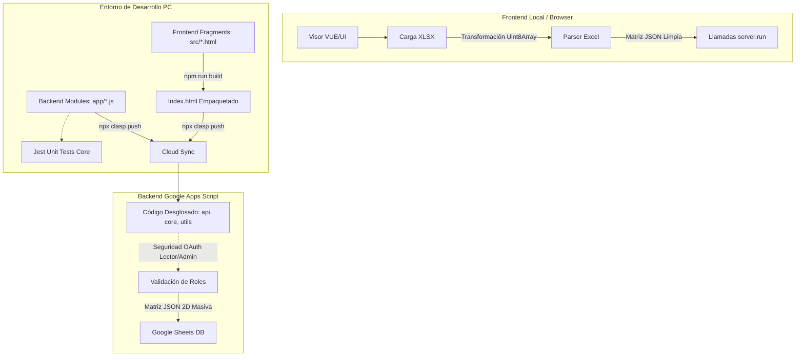

# 06 Architecture Spec (Post-Refactor)

## 1. Topología del Ecosistema

El proyecto ahora opera bajo una filosofía híbrida Desacoplada (Headless-Ready) utilizando la terminal OS pura para sincronizarse bidireccionalmente con la Infraestructura V8 en la nube mediante `@google/clasp`.

## 2. Flujo Directriz

1. **Desarrollo**: Modificar archivos en `src/` (HTML/CSS) o en `app/` (Servicios JS).
2. **Build**: Ejecutar `npm run build` para que node acople e inyecte silenciosamente el DOM.
3. **Pushear**: El comando empuja atómicamente el resultado final y los `.js` convertidos a `.gs` hacia la nube de producción.
4. **Validación**: Con correr `npm run test`, `Jest` verificará que no hayas destrozado `2_core.js`.
